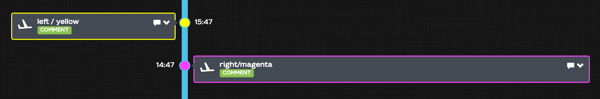

# Help page for IFT V2.0 available functions

**a pre-requisite is to know javascript. The functions belongs to a FW javascript object.**


## `FW.getEvent()`
Accesses the currently processed event. returns a EventV3IO object

## `FW.getEvents(reg, from, to, withDismissed, withHidden, severities, tags, count)`
requests the database for events filtered according to the parameter passed
* reg: the registration of the FWOT. if not passed, would return events for all your fleet
* from: the min date to search, moment or YYYY-MM-DDTHH:mm:ss string format
* to  : the max date to search, moment or YYYY-MM-DDTHH:mm:ss string format
* withDismissed : include or not the dismissed events
* showHidden : includes or not the hidden events
* severities: an array of severities to narrow the search (OR operator). Severities are one of IGNORE, CREW, WARNING, FAULT, ERROR, INFO. If not passed or null, takes all the severities
* tags: a list of tags to search for (OR operator).
* count: the max count for the search (throttled to 5000 elements max)

The call returns a promise that is catchable with .then(). the callback function returns a list of matching events. If an error occurs, the promise is catchable with .catch()

```javascript
var cms=FW.getEvent();

var tailNb = cms.reg;
var toDate = cms.computedDate;
var fromDate = moment.utc(cms.computedDate).add(-2, 'days');

//FW.getEvents(reg, from, to, withDismissed, showHidden, severities, tags, count)
//we search the events where tags are in "2420FJV7", "2420FJV8" in the last 2 days
FW.getEvents(cms.reg, fromDate, toDate, true, false, null, ["2420FJV7", "2420FJV8" ], 2)
.then(function(events) {
  if (events.length>0) { // if we find at least 1 event
    FW.notify ("Magdalena.TRZECIAKOWSKA@revima-apu.com",
               "LGB possible distress",
               "APU Chip Det - APU GEN A under-frequency");
  }
});
```

## `FW.notify(who, subject, body)`
Sends an e-mail to `who` with subject and eventually a body. A signature is always added to the message. It can be overridden with the AppConfig property `MAIL_TEMPLATE` using the groovy syntax. Few parameters are available.

	Check ${msg.sumUp} details <a href="${url}">here</a>
	<br>
	<br>
	<em>Health Monitoring by Flightwatching</em>

```javascript
FW.notify('support@flightwatching.com',
'My subject',
'Dear FW support team, ...');
```

## `FW.setFrom(reg)` and `FW.setTo(reg)`

Sets the `from` fwot and `to` fwot for the current message. the passed parameter has to be the registration of a known FWOT

```javascript
FW.setFrom('LFBO');
FW.setTo('EDHI');
```

## `FW.setTitle(title)`

You can override the default title for any event in an IFT. You can compose the title with the context of the event. Here is a sample:

```javascript
if (TRIGGER_CODE==='8100') {
  FW.setTitle('ECS REPORT<19> (UPK)')
}
```


Prefer it to `FW.reportInfo()` function for simple text information.

## `FW.setSeverity(level)`
You can override the default severity for any event in an IFT. Severity must be one of `WARNING, FAULT, ERROR, INFO`.

Here is a sample:

```javascript
if (TRIGGER_CODE==='4900') {
  FW.setSeverity('WARNING')
}
```

## `FW.setComputedDate(date|moment|ISO8601)`
sets the computed date. If some samples were previously created in the event, their date remains unchanged unless they have `timelabel=AT_EVENT`

```javascript
FW.setComputedDate(moment.utc(X, 'DDMMYYHHmmss'));
```


## `FW.setStyle(name, value)`
You can dynamically set the style of your event in the timeline view by setting some styling properties with this function. any name/value pair is accepted. 2 names are predefined for the display in the timeline:

* color: sets the color of the event in the timeline color is in the CSS3 format (http://www.w3schools.com/cssref/css_colors_legal.asp)
* pos: `'left'` or `'right'`. The event is on the left or the right side of the vertical time bar. Note that the position is set on the left on small devices (smartphones)

```javascript
FW.setStyle('color', 'yellow');
FW.setStyle('pos', 'left');
```


> those styles can be set manually for the comments thru the timeline


## `FW.getMessage()`
returns the current message. (EventV3IO)
## `FW.getSamples()`
returns the samples of the message. Instead of being separate variables, it is an array of SampleV3IO
## `FW.report(txt, severity, timestamp, flightPhase, faultCode)`
creates a new event with the passed severity. The timestamp is either a date, a moment object or a ISO8601 string. Flighphase is a string in constants.FlightStatus
the timestamp and flightphase are optional. If not provided, the message values are used (computedDate, severity)
## `FW.reportInfo(title, timestamp, flightPhase)`
shorthand for `FW.report(txt, 'INFO', timestamp, flightPhase)`
## `FW.reportWarn(txt, timestamp, flightPhase)`
shorthand for `FW.report(txt, 'WARNING', timestamp, flightPhase)`
## `FW.reportFault(txt, timestamp, flightPhase)`
shorthand for `FW.report(txt, 'FAULT', timestamp, flightPhase)`
## `FW.reportError(txt, timestamp, flightPhase)`
shorthand for `FW.report(txt, 'ERROR', timestamp, flightPhase)`
## `FW.log(txt)`
useful for testing. The logs are displayed in the administrator's logs
## `FW.updateProperties(props)`
Updates a field of the current event (associated with the event) a property is a property of an eventV3IO. Property is javascript object like (`{title:'new title'}`)
## `FW.setFlightStatus(flightStatus)`
shorthand for `FW.updateProperties({status:flightStatus})`
## `FW.setLoc(locOrReg, d)`
## `FW.setComputedDate(date, setBeforeTransmissionDate)`
## `FW.setTitle(title)`
shorthand for `FW.updateProperties({title:title})`
## `FW.setSeverity(severity)`
shorthand for `FW.updateProperties({severity:severity})`
## `FW.set(param, value, timestamp)`
creates a sample for the passed parameter. if timestamp is not passed, then the event timestamp is used
## `FW.updateSomeFwotProperty(reg, name, value)`
updates a property for a FWOT (reg)
## `FW.updateFwotProperty(name, value)`
updates a property for the current FWOT (FWOT of the event)
## `FW.removeFwotProperty(name)`
removes a property for the current FWOT (FWOT of the event)
## `FW.removeSomeFwotProperty(reg, name)`
removes a property for a FWOT (reg)

## `FW.postMessage(inputMessage)`
posts a message. Message is in the format inputMessageV3IO
## `FW.uplink(layoutId, delayInSec)`
uplinks the message in `delayInSec` seconds
## `FW.tag(tag)`
tags the event with tag; If called several times, tag remains unique (no effect)
## `FW.untag(tag)`
removes a tag from the event
## `FW.reportFaultCode(code, timestamp, flightPhase, sev, description)`
Creates a fault message (fault code)
