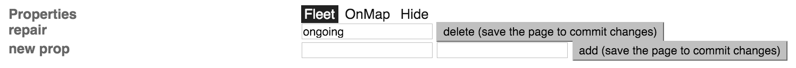
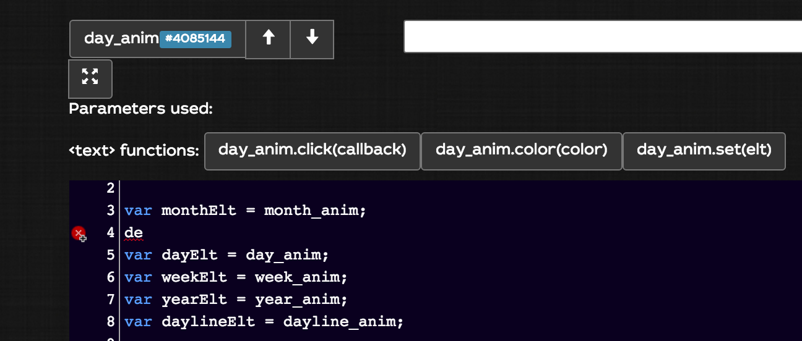
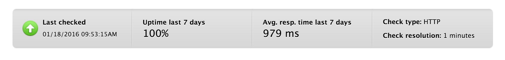
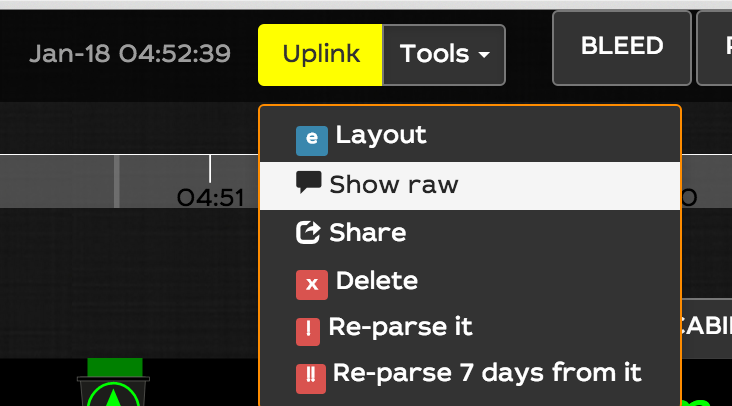
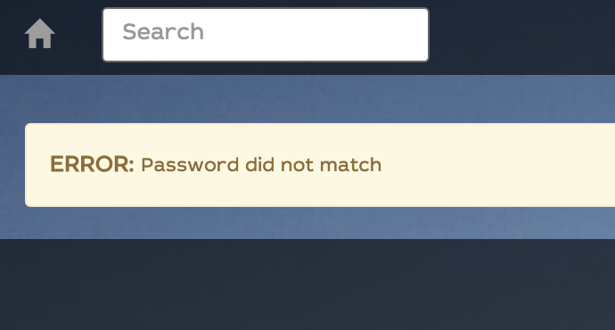
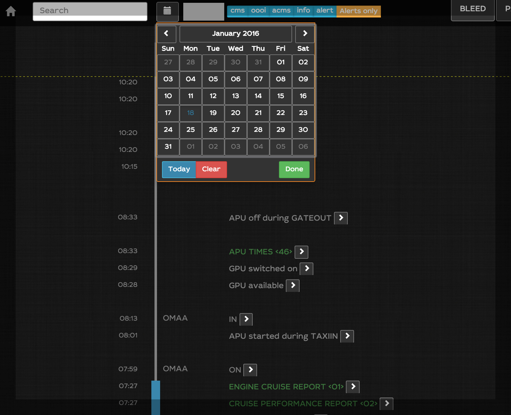
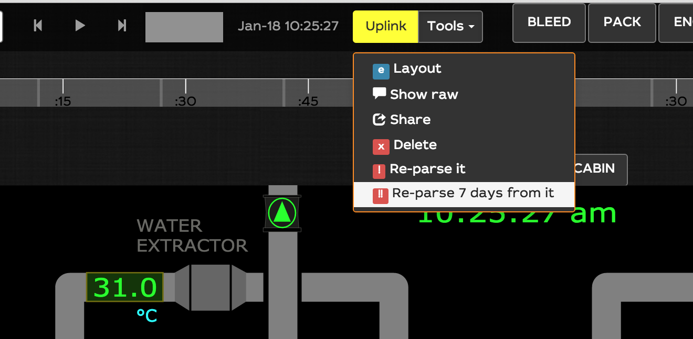
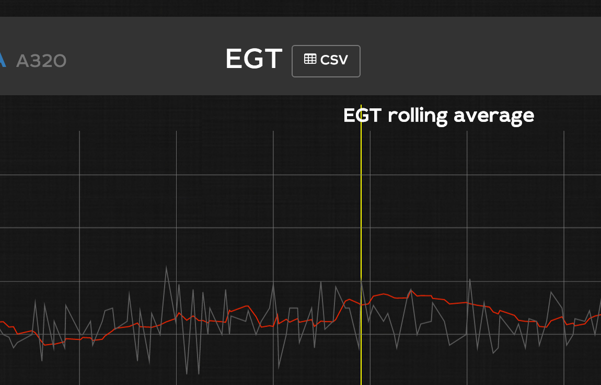
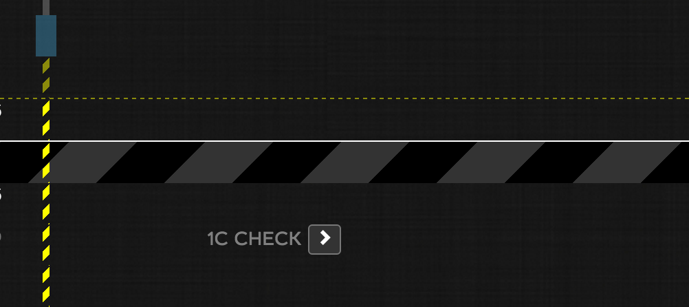

End 2015 release notes
==========

- [End 2015 release notes](#)
	- [WILCO operational reliability](#wilco-operational-reliability)

Easier fleet  page
-----
you can now create your own fleet page with filtered fwots:

1. set a property on your fwot (`actions > general admin > fwots > _your fwot_`)

2. go to the fleet page with arguments

> example

> [https://site.flightwatching.com/wilco/#/fwots/aircraft?repair=ongoing](https://site.flightwatching.com/wilco/#/fwots/aircraft?repair=ongoing) where aircraft is the category of the fwot and `repair=ongoing` is the filter against props

You can also specify the count of columns you want in the page (1, 2, 3, 4, 6, 12)
> example

>[https://site.flightwatching.com/wilco/#/fwots/aircraft?cols=3&repair=ongoing](https://site.flightwatching.com/wilco/#/fwots/aircraft?cols=3&repair=ongoing)

Easier fleet dashboard page
-----
When creating a dashboard for a fleet, you don't need anymore to define the parameters you need to animate it and call `WILCO.getSamplesForFwot(FWOT.reg...)`

WILCO does it for you, it detects the parameters it needs and makes the call for you

> example

> [https://site.flightwatching.com/wilco/#/fwots/aircraft?db=22524850&cols=3&repair=ongoing](https://site.flightwatching.com/wilco/#/fwots/aircraft?db=22524850&cols=3&repair=ongoing)

New dashboard designer page
------
It has been redesigned with several rules for each `_anim`, and has syntax highlighting and full screen mode for editing large rules

WILCO operational reliability
-----
WILCO is monitored even when you are offline and you can access operational reliability on different geographic zones You can access the full stats for your private deployment. For security reason, a unique URL has to be created for you. If you want to access it, please send an e-mail to [support@flightwatching.com]()
so that we create this address.

> tip: bookmark it in WILCO

Change font to leto-sans
-----
The look and feel has been reviewed with a neat font, it enhances readibility and spacing management. The background is less dark and textured to light up dashboards

Raw messages only visible to admins
----
Raw messages are not for officers. It is displayed only for admins

Login fail behavior
------
In case you enter wrong crendentials, a better error message is displayed

Calendar selection in Timeline
------
Want to navigate in the timeline far away in the past? pick up the date in the Calendar

reparse all limited to last 7 days from the current message
------
Reparse all feature is limited to 7 days from the message currently viewed.

export CSV function from trend
-----
You can export the data to a CSV format from trend page view. You can freely use it in excel or any external tool.

> you could do it using the API for a long time. For automation, using the API is strongly recommended in that case.

Timeline -> add a repair in Timeline
-----
We have added a new status for the fwot in the timeline that fits to repairs

better access to history from the samples
-----

dashbaord query optimization
------

libraries upgrade
----

Dashboard rules sort function
----

Fault codes
-----

parameters
------

Fleet dashbaords
-----
many fixes (and sorting)

External layout support
-----
