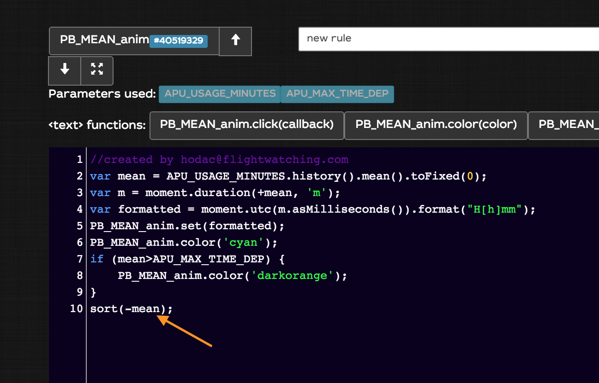
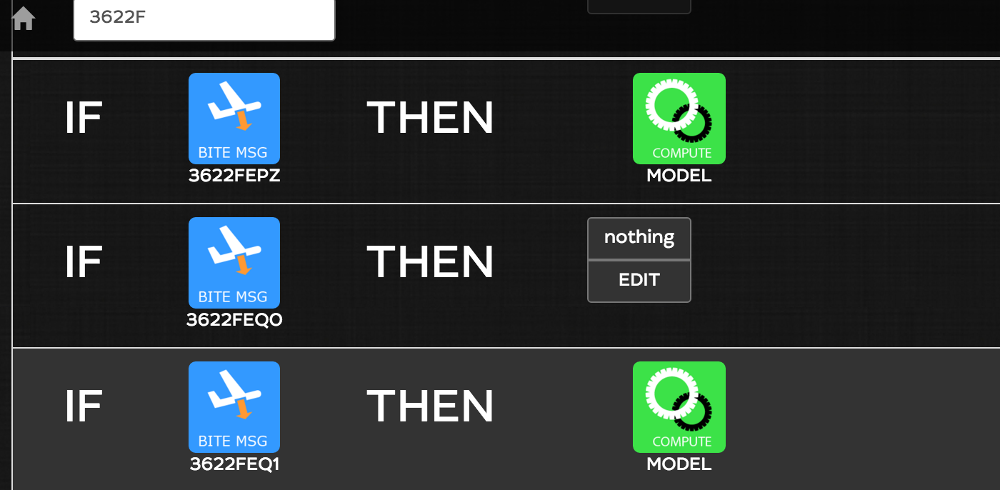
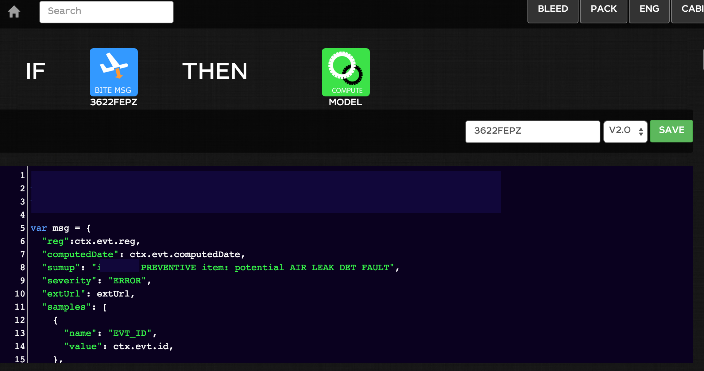
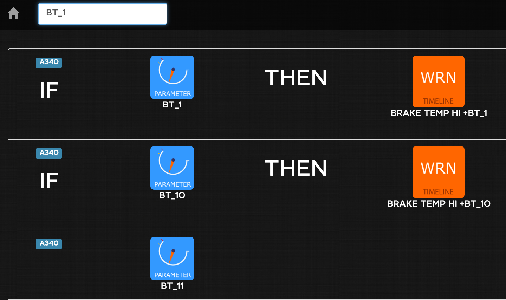
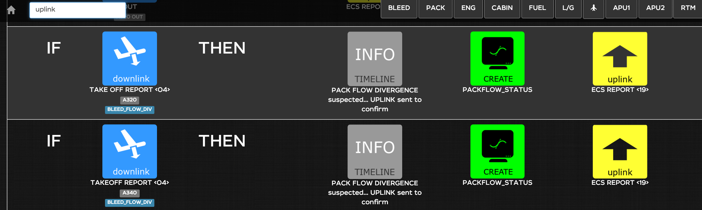

End 2015 release notes
==========

- [End 2015 release notes](#)
	- [Build your fleet  page](#)
	- [New functions in dashboard rules](#)
	- [New dashboard designer page](#)
	- [WILCO operational reliability](#)
	- [New Font : leto-sans](#)
	- [Raw messages only visible to admins](#)
	- [Login fail behavior](#)
	- [Calendar selection in Timeline](#)
	- [reparse all limited to last 7 days](#)
	- [export CSV function from trend](#)
	- [Repair phase in Timeline](#)
	- [libraries upgrade](#)
	- [Fault codes](#)
	- [Parameters](#)
	- [IFTs](#)
	- [External layout support](#)
	- [email option](#)
	- [XLS adapters](#)

Build your fleet page
-----
you can now create your own fleet page with filtered fwots:

1. set a property on your fwot (`actions > general admin > fwots > _your fwot_`)

2. go to the fleet page with arguments

> example

> [https://site.flightwatching.com/wilco/#/fwots/aircraft?repair=ongoing](https://site.flightwatching.com/wilco/#/fwots/aircraft?repair=ongoing) where aircraft is the category of the fwot and `repair=ongoing` is the filter against props

You can also specify the number of columns you want in the page (1, 2, 3, 4, 6, 12)
> example

>[https://site.flightwatching.com/wilco/#/fwots/aircraft?cols=3&repair=ongoing](https://site.flightwatching.com/wilco/#/fwots/aircraft?cols=3&repair=ongoing)

New functions in dashboard rules
-----
When creating a dashboard for a fleet, you don't need anymore to define the parameters you need to animate it and call `WILCO.getSamplesForFwot(FWOT.reg...)`

WILCO does it for you, it detects the parameters it needs and makes the call for you

> example

> [https://site.flightwatching.com/wilco/#/fwots/aircraft?db=22524850&cols=3&repair=ongoing](https://site.flightwatching.com/wilco/#/fwots/aircraft?db=22524850&cols=3&repair=ongoing)

You can also use a `sort` function in the rules to sort the fwots in the fleet view as described

in the following example, we sort from the greatest mean value to th e lowest.

New dashboard designer page
------
It has been redesigned with several rules for each `_anim`, syntax control si highlighted and full screen mode can be displayed for editing large rules

WILCO operational reliability
-----
WILCO is automatically monitored even when users are offline and you can access operational reliability stats on different geographic zones You can access full stats for your private deployment. For security reason, a unique URL has to be created for you. If you want to access it, please send an e-mail to [support@flightwatching.com]()
so that we create this address.

> tip: bookmark it in WILCO

New Font : leto-sans
-----
The look and feel has been reviewed with a neat font, it enhances readibility and spacing management. The background is less dark and textured to light up dashboards

Raw messages only visible to admins
----
Raw messages are not for officers. It is displayed only for admins in this new version

Login fail behavior
------
In case you enter wrong crendentials, the error message displayed becomes clear

Calendar selection in Timeline
------
Want to navigate in the timeline far away in the past? Pick up the date in the Calendar

Reparse all limited to last 7 days
------
Reparse all feature is limited to 7 days from the message currently viewed.

export CSV function from trend
-----
You can export the data to a CSV format from trend page view. You can freely use it in excel or any external tool.

> In previous versions you could done it using the API (and that since a long time). For automation, we recommend using the API.

Repair phase in Timeline
-----
We have added a new status for the fwot in the timeline that fits to repairs. Example : an aircraft in hangar for maintenance check.

libraries upgrade
----
A bunch of libraries have been updated, better stability and cutting edge technology

Fault codes
-----
Fault codes are gathered and visible from the admin view (`actions > edit faultcodes`). A fault code are messages embedded in A380 CFR and PFR. They are paginated to speed up the navigation. You can search for faultcodes by typing the beginning of the code in the search box and WILCO makes live filtering across all the known fault codes.

You can attach an IFT to a fault code which will be executed as soon as WILCO receives the fault code (WARNING: may be in the PFR or after, say after the flight, it depends on the aircraft context)

Parameters
------
'Edit parameters' has also been redesigned. It is now paginated and each parameter is a row. The search box is usable and the filtering matches all the parameters that contains the searched text. If an IFT is attached to the parameter, it is also displayed.

IFTs
------
IFT listing is also paginated to handle a large amount of IFTs

External layout support
-----
You can now reference websocket external sources

email option
------
Optionally, WILCO can have it's own email adress. Send an attachment to this address, it will be injected into WILCO.

XLS adapters
-----
Excel files under .xls format can specifically be decoded and injected into WILCO either manually or by sending them by e-mail. The decoding is subject to a purchase order
