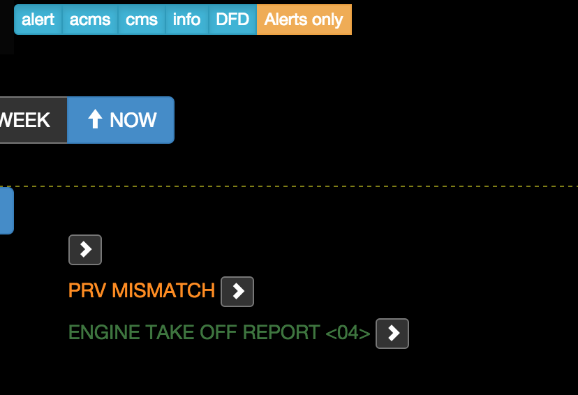
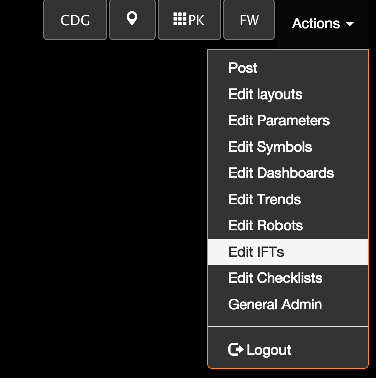

Mid 2015 release notes
==========

- [Mid 2015 release notes](#)
	- [Landing page bookmarks](#landing-page-bookmarks)
	- [Fleet dashboards](#fleet-dashboards)
	- [Multiple columns fleet view](#multiple-columns-fleet-view)
	- [Add an alert zone in Fleet view](#add-an-alert-zone-in-fleet-view)
	- [OSM World map](#osm-world-map)
	- [show passed events in the timeline](#show-passed-events-in-the-timeline)
	- [Alerts only](#alerts-only)
	- [Manual add comments in the timeline](#manual-add-comments-in-the-timeline)
	- [Fixed timeline](#fixed-timeline)
	- [IFT visualization](#ift-visualization)
	- [Constants](#constants)
	- [New trend pages](#new-trend-pages)
	- [CSV import - multi date format](#csv-import---multi-date-format)

Landing page bookmarks
-----
The landing page can be configured by using the bookmarks. There is a new field in the  general administration page under `edit bookmarks`. If landing page is ticked, then the bookmark is a landing page one.

* if there is no landing page bookmark, the landing page is the fleet view
* if there is one landing page bookmark only, the landing page is the one selected
* if there is more than one landing page, a new selection page is the landing page

Fleet dashboards
------
You can override the default fleet FWOT thumbnail by any dashboard. In this case, remember you are not in an `event scope, that means that some parameters like EVT, SAMPLES... are not available. On the other hand, you have a FWOT variable set up (see https://github.com/flightwatching/wilco-api/tree/master/docs/dashboards#FWOT)

Now that you have a dashboard set up, just append to the fleet view 
`http://localhost:9000/#/fleet` -> `http://localhost:9000/#/fleet?db=53425`

Multiple columns fleet view
------
the number of columns of the fleet view can be set in the URL to see more FWOT in the same screen. authorized values are 2, 3, 4 6 and 12 columns

Add an alert zone in Fleet view
-----
An alert zone has been added to the fleet view where only the alert FWOT appear

OSM World map
-----
The world map for locating objects is now a real OSM map to have details as gates and airport maps

show passed events in the timeline
-------
You can go straight to a date in the timeline by adding a date in the URL: `https://demo.flightwatching.com/wilco/#/F-FWBZ/history?to=2015-05-29T09:06:02` (helpful to send by e-mail)

the `to` query is a ISO time in the format YYYY-MM-DDTHH:mm:ss in UTC time.

When you click on the FWOT from an event, it brings you to the timeline at the right place. The timeline's most recent date is the current message date and you have some buttons to stick to real-time update

Alerts only
----
All messages with severity level greater or equal than `warning` (therefore amber and red) are filtered at server level. You can go straight to the important points by using this feature instead of scrolling down for a long time and filtering afterwards which leads to a lot of lag.
 
The selection can be provided in the URL by adding the important parameter (helpful for bookmarks):
 `https://demo.flightwatching.com/wilco/#/F-FWBZ/history?to=2015-05-29T09:06:02&important=true`

Manual add comments in the timeline
-----------

You can insert some comments in the timeline for a FWOT. Simply click the blue or grey vertical timeline. Where the color dims, you can click to add a comment

Then you get a form with a title and some details. It is prefilled with a comment to the clicked place, your signature and the exact same date as the clicked element.

You can override all the fields and set a severity (which corresponds to a color)

Fixed timeline
-------
On events where there are multiple time offsets, the horizontal local timeline is fixed: when you scroll down, it is still visible with some transparency

IFT visualization
-----
You can browse your IFTs whatever the object it works on. in admin, go to edit IFTs

The list of your IFTs is shown with the trigger on the left and a sum up of the actions in the right part.
In the search field, you can filter the IFTs on anything that is in the code of the IFTs or the ID...

If you want to show some usefull information in the trigger part, add a comment on the first line of your IFT like this

`//IF: A320 A330 A340 OUT`

will display

Constants
-----
Instead of putting thresholds or constants as figures in the IFTs, we have created some constants (name/value pairs) so that it has a name and can be reused in several places as dashboard rules, IFTs, symbols or matrices. You have consistancy between those objects and the writing is more readable. From now, if you want to change a threshold for example, just go to constants and modify the value. The IFTs, dashboards and matrices are all consistants

how to set: actions -> general admin -> constants

New trend pages
--------
We have redesigned the trend page to enable several features:

###on the fly computation. 
Instead of visualizing raw data, you can tell wilco to represent the output of a computation or a conditionnal structure

###2 axis graphs
You can mix curves where the magnitude is very different on 2 axes (left and right)

###You can choose the colors manually
With a color picker (depends on your browser)

###You can specify rolling average on the data to scrub high freq variations
On the bottom left part of the graphs, change the value to make rolling average on n points around each point. Be careful on short datasets, it can be wrong if not enough samples

### you can stack several graphs that are synchronized in time and stretch
### you can save the configurations (even timewize)
`https://demo.flightwatching.com/wilco/#/designer/trends/1911865/FW-AAA?edit=false&from=2015-05-13T03:17:20&to=2015-06-10T03:17:20`

### new samples are added in real-time

CSV import - multi date format
------
when importing a CSV, the date+time columns can have several formats. 

The date formats can be:

* yyyy/MM/dd
* yyyy/MM/dd
* dd/MM/yyyy
* yyyy-MM-dd
* yyyy-MM-dd

and the time formats can be:

* HH:mm
* HH:mm:ss
* HH:mm:ss
* HH:mm:ss.SSS
* HH:mm:ss

