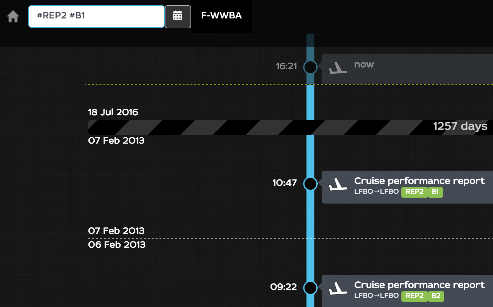
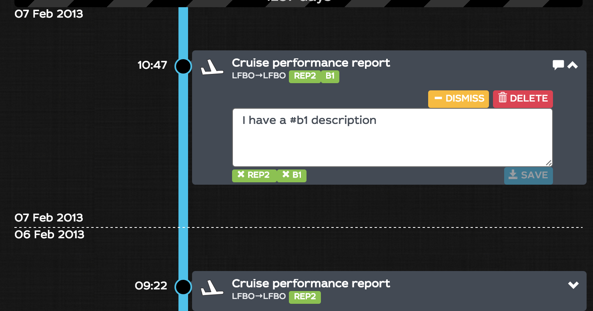
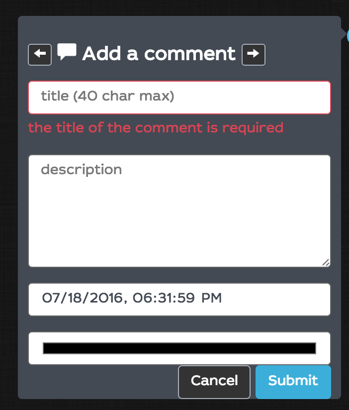
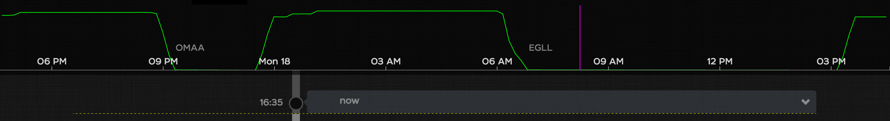
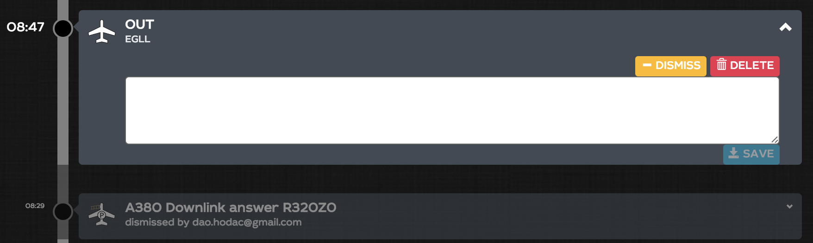
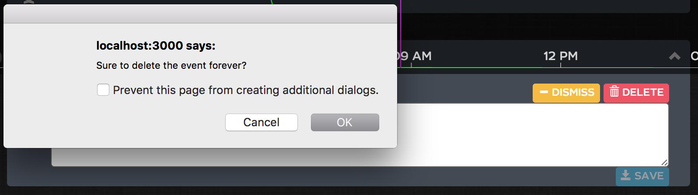
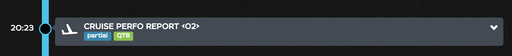
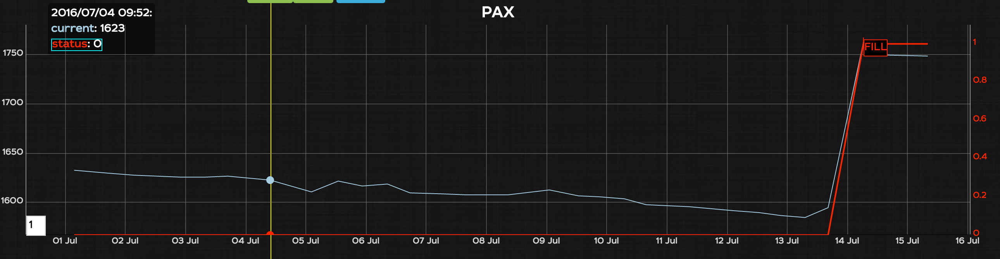
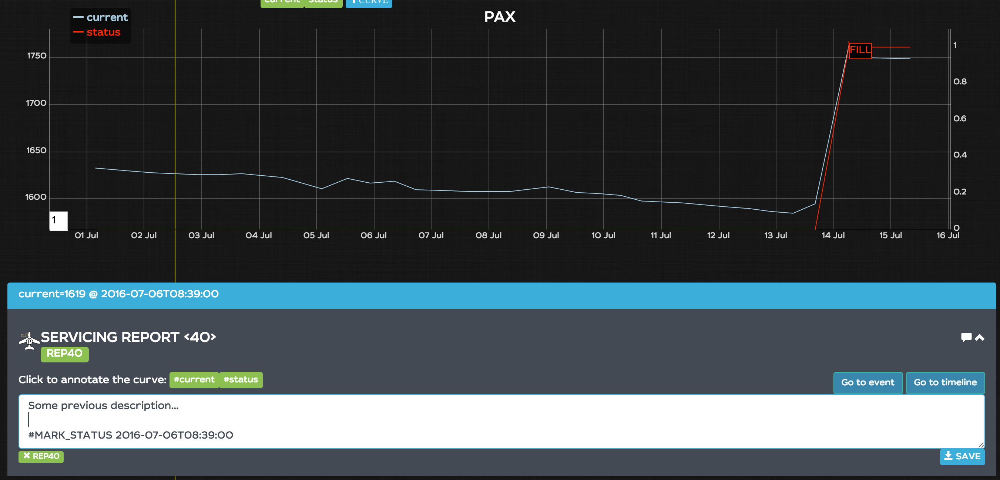

# Release notes for version release-monkey-1

July 2016

----

# Timeline
----

## Timeline tag search

**reserved tag names (starts witn IFT_ or MARK_)**

In the timeline, you can search for tags in the search box to filter on those tags. Searching for tags requires that you prefix the tag by a hashtag. Searchig multiple tags is possible, in that case it is a OR binary operation

Tags are shown as green labels in each event. You can click on it to add the corresponding filter on the fly

The search filter is saved in the URL as you type so that you can bookmark or reference this search to have direct access

`http://localhost:3000/#/F-WWBA/timeline?important=false&find=%23REP2%20%23B1`

---

## Large description on all messages

On every event, you can add a description that comes with the title. A description is plain text limited to 1500 chars
The description may contain some `#FOO` elements. In that case, WILCO will automatically create tags for the event according to this (in that case a `FOO` tag). You can delete any tag by clicking on the tags below the description edit box

If a description exists for a message a little cartoon bubble is added in the timeline.

---

## Timeline comments creation

You can click on any timeline circle to create a comment manually. Set the title, the description, set it left or right with the arrows, override the date and the color.

---

## Timeline flight profile displayed (with alerts)

If wilco has some altitude information, a fixed flight profile overlay is shown. Altitude, airports and warnings are displayed with the currently hovered event position.

---

## Timeline dismiss button

You can dismiss or recall an event. It will be dimmed and the name of the dismisser is shown. anybody can recall or dismiss any event.

---

## Timeline delete button

You can delete an event. It will be removed from the database with all the samples and reports depending on it. A confirmation box pops up before performing

---

## Timeline detect partial messages

Timeline detects partial messages and shows it as a blue label. Partial messages are messages which transmission is interrupted. Wilco makes its best to decode as many samples as possible, but dashboards and IFTs may be partial

---

# Trends

---

## Trends: Left sided legends
Legend has been moved to the left side of the trend to overlay less important data (passed data)

---
## Bookmarks add photos to bookmarks
Now you can add a photo to each bookmark in the administration view. If the bookmark is ticked `landingPage` then the photo will be displayed.

** There is no restriction about the size of the image it is up to the user to crop the image and make all the landing page bookmarks the same width and height**

## Annotation on trends
When clicking on the dot, Wilco doesn't bring you anymore directly to the timeline or the Event.

When you click on the dot WILCO opens a snippet of the event just below the trend with some additional functions.

in the opened panel the name of the different curves are shown and you can click `Click to annotate the curve` add the annotation. A small text is appended to the description with a tag starting with #MARK_, a date. You can append some short text to the line  and save to make the annotation appear.

To remove an annotation, remove the associated mark (below the event description)

** for some reason, you may have to refresh your page for tha annotation to be displayed.**

---
# IFTs
---

##IFT documentation
a list of usable functions are provided in https://github.com/flightwatching/wilco-api/blob/master/docs/IFTs/ift-V2.0.md

https://github.com/flightwatching/wilco-api/blob/master/docs/IFTs/ift-V1.3.md

## add a FW.setTitle IFT function (V2.0 language)

see https://github.com/flightwatching/wilco-api/blob/master/docs/IFTs/ift-V2.0.md#fwsettitletitle

----
## add a FW.setSeverity IFT function (V2.0 language)

see https://github.com/flightwatching/wilco-api/blob/master/docs/IFTs/ift-V2.0.md#fwsetSeverityseverity

----
## add a FW.setFrom/FW.setTo IFT function (V2.0 language)

see
https://github.com/flightwatching/wilco-api/blob/master/docs/IFTs/ift-V2.0.md#fwsetfromreg-and-fwsettoreg

----

## add a FW.setComputedDate IFT function (V2.0 language)

see
https://github.com/flightwatching/wilco-api/blob/master/docs/IFTs/ift-V2.0.md#fwsetcomputeddatedatemomentiso8601

----
## IFTs in layout cells
You can add some IFTs in each cell of a IeiReport. This is useful to avoid creating a temporary sample to be processed later on in an IFT. Here you have all the flexibility of FW functions and javascript to transform the raw data on the fly.

----

## IFT: setStyle feature

see
https://github.com/flightwatching/wilco-api/blob/master/docs/IFTs/ift-V2.0.md#fwsetstylename-value
---

## Mail: IFT body parameter
---
https://github.com/flightwatching/wilco-api/blob/master/docs/IFTs/ift-V2.0.md#fwnotifywho-subject-body

---
# Various
---

## libraries upgrade
update some front-end libraries

---

## Move to materiel design look&feel
moving from bootstrap CSS to bootflat CSS. Some color and fonts may change

---

## Internet explorer fix for small dashboards
---
Avoid problem on IE when dashbaord height is ridiculously small.

** It does not mean that WILCO is compatible with IE**
