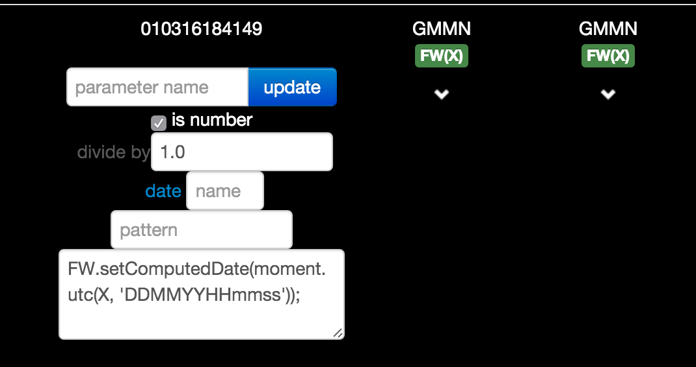

# Release notes for version release-monkey-1
----

## add a FW.setTitle IFT function (V2.0 language)

You can override the default title for any event in an IFT. You can compose the title with the context of the event. Here is a sample:

```javascript
if (TRIGGER_CODE==='8100') {
  FW.setTitle('ECS REPORT<19> (UPK)')
}
```


Prefer it to `FW.reportInfo()` function for simple text information.

----
## add a FW.setSeverity IFT function (V2.0 language)


You can override the default severity for any event in an IFT. Severity must be one of `WARNING, FAULT, ERROR, INFO`.

Here is a sample:

```javascript
if (TRIGGER_CODE==='4900') {
  FW.setSeverity('WARNING')
}
```


----
## add a FW.setFrom/FW.setTo IFT function (V2.0 language)

sets the `from` and `to` field in the current event
```javascript
FW.setFrom('LFBO')
FW.setTo('LFBO')
```
----

## add a FW.setComputedDate IFT function (V2.0 language)

sets the computed date. If some samples were previously created in the event, their date remains unchanged unless they have `timelabel=AT_EVENT`

```javascript
FW.setComputedDate(moment.utc(X, 'DDMMYYHHmmss'));
```
----
## IFTs in layout cells
You can add some IFTs in each cell of a IeiReport. This is useful to avoid creating a temporary sample to be processed later on in an IFT. Here you have all the flexibility of FW functions and javascript to transform the raw data on the fly.



----

## Timeline tag search

**reserved tag names (starts witn IFT or MARK)**

---

## Large description on all messages
---

## Timeline comments creation
---

## Timeline flight profile displayed (with alerts)
---

## Timeline dismiss button
---

## Timeline delete button
---

## Timeline detect partial messages
---

## Annotation on trends

---
## Trends: Left sided legends

---

## libraries upgrade

---

## Move to materiel design look&feel
---

## Internet explorer fix for small dashboards
---


# NOT DONE YET

## display the scheduled actions

## JAVA 8

## node 5.5

## Fix ACARS multipart messages handling

## mongoDB

## change event properties in IFTs
