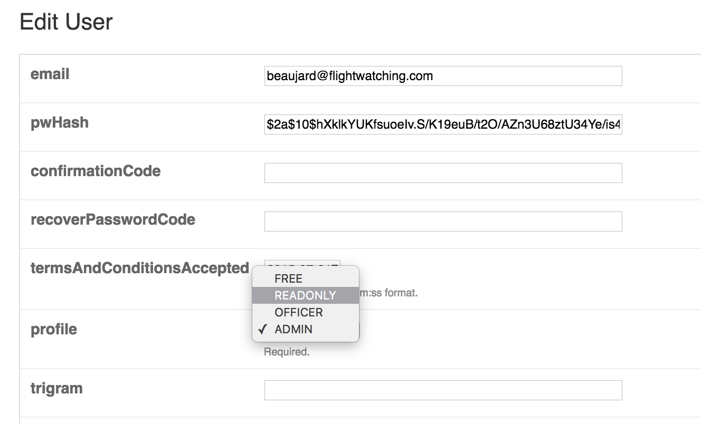

# Release notes for version release-monkey-2

Dec 2016

# READ-ONLY role
A read-only role has been added. A user with this role can only read data. He cannot dismiss, commen, uplink, post messages, ...

