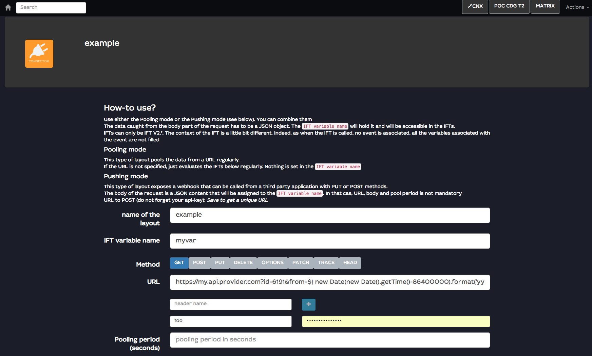
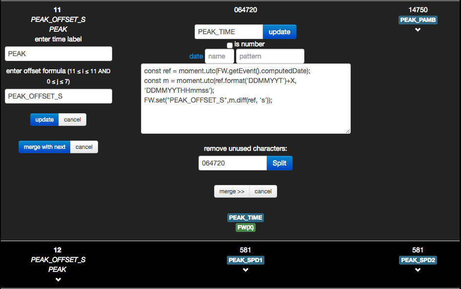
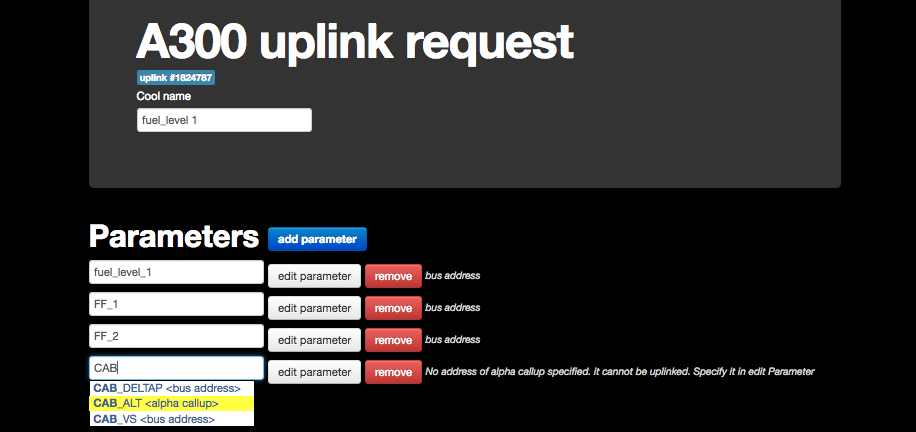
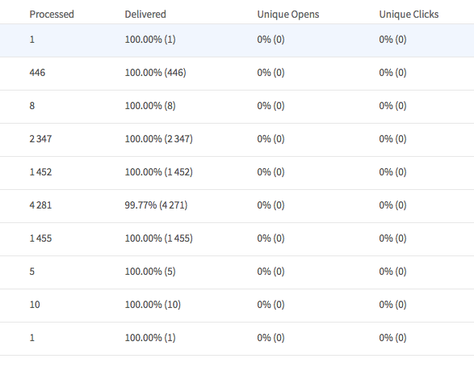
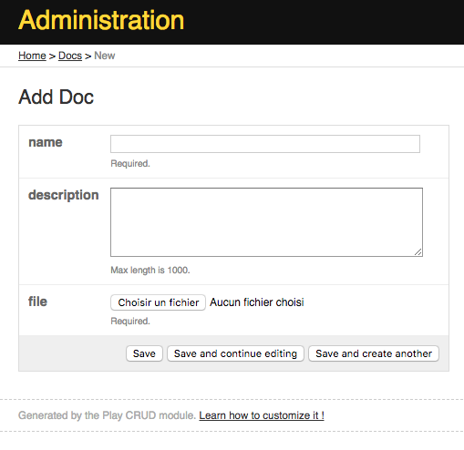
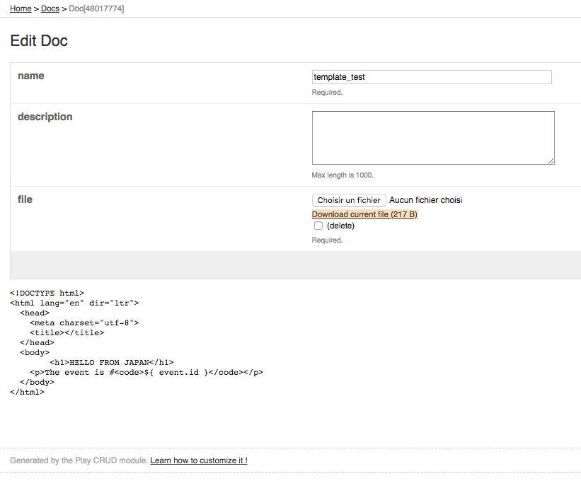
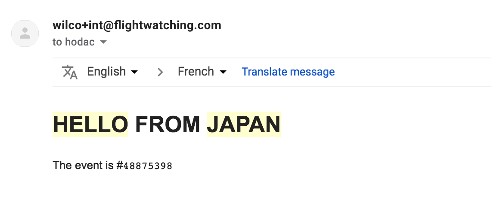
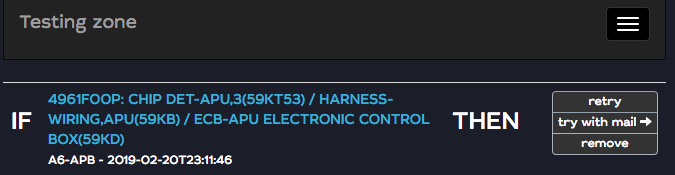

# Release notes for version release-dog-1

This release has been developped during Y2018 and released at the beginning of Y2019. It includes several backend improvements on stability and performances. A few new features have been included.

To have a complete view in the features and fixes

- Front-end: https://github.com/flightwatching/wilco-desktop-client/commits/master
- back-end: https://github.com/flightwatching/fleet-monitor/commits/master
- IFTs: https://github.com/flightwatching/wilco-ift/commits/master


# User features

## IFT versions
Prefer now IFT V2 that will be enriched. IFT V1.3 are now supported but will not implement the new IFT features.

## Push/pull connector URL template
The given URL is now a template that means that you can dynamically compute it. Some of the webservices takes the date in parameter, for instance. You can use it. The syntax is groovy templating. you can find a cheatsheet here: [https://www.playframework.com/documentation/1.5.x/cheatsheet/templates](https://www.playframework.com/documentation/1.5.x/cheatsheet/templates)


Here is an example that computes 2 dates, `from:1 day ago`, `to:now`



```
https://my.api.provider.com?id=6191&from=${ new Date(new Date().getTime()-86400000).format('yyyy-MM-dd hh:mm:ss')}&to=${ new Date().format('yyyy-MM-dd hh:mm:ss')}
```


## On the fly samples usable in Iei formulaes
Samples that have been created within a iei param are now usable either to compute the time offset of a following iei or in other iei IFTs



## Helpers in uplink request layouts
Uplink feature  needs alphacall ups or ARINC addresses. This information has to be set in the parameters advanced page. If it is missing, or if the uplink request is a mix of addresses and alphacall ups, then the uplink fails.

When creating a uplink request, WILCO checks for the completion and the consistancy of the request and helps the user to validate the uplink before saving it



## Uplink options
According to the uplink template, it is now possible to pass some extra parameters thru the IFT.
The extra parameters are used in the template as per [https://www.playframework.com/documentation/1.5.x/cheatsheet/templates](https://www.playframework.com/documentation/1.5.x/cheatsheet/templates)

``` javascript
//this will uplink the uplink request 12345 in 0 seconds with an extra parameter inhibitionDayCount.
FW.uplink(12345, 0, ["inhibitionDayCount:99"]);
```

## External services notifications
The email sending has been delegated to a third party service (Mailgun). In addition of ensuring better delivery, it allows to add notifications on delivery failures (permanent and temporary failing addresses) and allows to add notifications when the email links are clicked. Today, this configuration can only be set up by FW team (request has to be sent to the support)




## Documents (beta)
You can add documents to WILCO in the admin console (/fleet/admin/docs).



You'll have to pass a name, an optionnal description and the file itself. You will be given a unique ID when saving.

The file is accessible now thru the address `/fleet/admin/docs/<ID>/file` with READONLY/OFFICER/ADMIN credentials.


## Notify body templates (beta)
Documents are very usefull to save e-mail body templates. When you save a doc that is a text file with a decent size, it is shown directly in the document administration view



Now in any IFT, you can use this template as the body of a message. There is a new function `FW.notifyWithTemplate(who, subject, <ID>, params)` that allows you to pass the <ID> of the template as parameter instead of the body. WILCO will take it as the content of the message.

As you can see in the example, you can pass parameters to the template. here it is `${event.id}`. The syntax is the groovy syntax (see [https://www.playframework.com/documentation/1.5.x/cheatsheet/templates](https://www.playframework.com/documentation/1.5.x/cheatsheet/templates))

So for example, you can call
```
FW.notifyWithTemplate(
  'hodac@flightwatching.com',
  'test template',
  48017774,
  {
    event: {
      id:id
    },
    other: 'any json object'
  }
)
```

to generate this kind of email




## Notify testing

Templates needs to be tested. You can now test an IFT that sends an email with the option actually send it. The recipient will be overridden by the user's login email or any email that he wants. A prompt box appears for that when clicking the button



## Async/Await support
IFTs supports now `ES6`and async/awaits for FW.* functions. See below

## Query samples in IFT V2


> This function gets rid of the use of a lot of fwot.properties and should be prefered.
> fwot.properties is very convenient but is a real mess when reprocessing data.

You can now query WILCO for samples. It allows to make real analytics on message reception.
a new function. Each sample is a [SampleV3IO](https://github.com/flightwatching/wilco-api/blob/master/java/com/fw/wilco/api/SampleV3IO.java)

```
FW.querySamples(
  regs,           // an array of fwot registrations. if null, this field is replaced by the event's fwot.
  names,          // the name of a parameter or an array of parameter names
  from,           // A date, a moment or a string that specifies the begin time window of the request. can be null
  to,             // A date, a moment or a string that specifies the end time window of the request. if null or not passed, the date of the event is considered
  withInvalid,    // a boolean to mention if WILCO has to return the invalid data. null or no parameter means that it should not
  chronological,  // the ordering of the returned array
  page,           // the paging. 1 by default
  count           // the max count of samples to be returned
)
```

This function is powerful being used asynced

```
const s = await FW.querySamples("ABS", 'A', '2017-05-15T00:00:00');
//returns all the samples of parameter A of fwot ABS since 2017-05-15T00:00:00, up to the event's date
const values = s.map(s=>s.value);
//values is an array of all the values.
```

## Access to any webservice
`axios` is directly accessible to use any external service from WILCO.

you can get/set data like
* MIS
* weather
* FR24
* servers
* trello, github, google...


## Access to apiv3
Now you can use all the apiV3 from the IFTs with `FW.wilco`. It will use the `axios` library and credentials are already in place.

ApiV3 is defined in swaggerHub. Thank's to APIV3, you can get all the information on samples, events, fwots,  bigdata information.

## Access to big data information in WILCO
Now you can access to the bigdata elasticsearch from WILCO (dashboards and IFTs) to take benefit of the analysis abilities, the ML, etc...

https://youdomain.flightwatching.com/fleet/apiv3/es/_search

You can use the [whole API of elasticsearch](https://www.elastic.co/guide/en/elasticsearch/reference/current/index.html)


## Math/Stats support (beta)
We start adding math functions. First step is linear basic functions

### Least Square algorithm

You can run least square algorithm on any set of values.

```
leastSquares= function(xSeries, ySeries)
//xSeries is an array of numerical
//ySeries is an array of numerical. Should have the same length

//returns: {slope, intercept, rSquare}

//slope is the "derivative of the least square approximation, intercept is the x where y is 0 and rSquare is the precision of the approximation"
```

The function is powerful used in conjunction with `querySamples`

_example_

```javascript

```


### Predict algorithm
Predict uses the least square algorithm and returns the `x` value for which `y` is `yval`. For example: when the oxygen level will reach 1600 if we decrease linearly?

```javascript
const oxyLevelLimit = 1600;
const alertTime = predict(times, oxyLevels, oxyLevelLimit)
```
