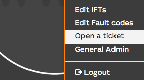
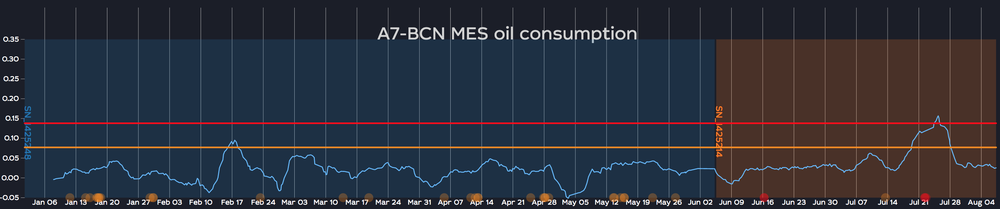

# Release notes for version release-pig-1

This release has been developped during Y2019 and released at the end of 2019. It mainly contains performance improvements on accessing the samples to cover the issues of slow trend/matrix rendering. This slow rendering also leads to server connexion overloads.

To have a complete view in the features and fixes

- Front-end: https://github.com/flightwatching/wilco-desktop-client/commits/master
- back-end: https://github.com/flightwatching/fleet-monitor/commits/master
- IFTs: https://github.com/flightwatching/wilco-ift/commits/master

--------------

# Open a ticket!
An issue with the tool? a bug? an improvement or a service requirement? everything can be initiated by opening a ticket. A ticket ID is associated so that you talk directly with you team. The further conversation will be thru email. 



------------------
# New email feature (with attachments!)

## FW.notify -> FW.email
We have deprecated the old `FW.notify` function. It is still maintained but we recommand using the new `FW.email` feature. To help the migration, we have tagged the `FW.notify` calls with a different icon (when you list the IFTs):

 

Definition: 

 `await FW.email (dest, subject, options = {cc:null, bcc:null, body:{text:""}, attachments:[]})`

 - `dest`: a string that is a comma separated list of email addresses (recipients)
 - `subject`: a string that will be the subject of the mail
 - `opts`: an optional object. Each option is optional.
      - `cc`: string that is a comma separated list of email addresses (carbon copy)
      - `bcc`: string that is a comma separated list of email addresses (blind carbon copy)
	  - `body`: 
	  	- `text`: if the body is plain text. `\n` is the character for a new line
		- `docId`: the id of a document in wilco (see /fleet/admin/docs). The document is either a static file or a template (see `variables`)
		- `variables`: a key value structure that will be passed to the doc (`docId`) to instanciate the template
	- `attachments`: an array of attachment. an attachment is an object with those values
		- `absolutePath`: the path of the file you want to attach. WARNING: it is the path in the server. So it is not directly readable from your client. The only usecase is the snapshot usecase (see below)
		- `docId`: the id of a document in wilco (see /fleet/admin/docs). The document is either a static file or a template (see `variables`)
		- `variables`: a key value structure that will be passed to the doc (`docId`) to instanciate the template


 Examples of calls:

- simplest call:  `await FW.email ("laurel@hal-roach.com, hardy@hal-roach.com", "the subject")` 
- simplest call with body:  `await FW.email ("laurel@hal-roach.com, hardy@hal-roach.com", "the subject", {body: {text: "this is the body"} })` 
- a call with a template as body and a `cc`: 
```await FW.email ("laurel@hal-roach.com, hardy@hal-roach.com", "the subject", {cc: "sales@fox.com", body: {docId: 83391, variables: {a: 1, b: {sub1: "my first option", sub2: my second option}}} })```
- a call with a template as attachment: 
```await FW.email ("laurel@hal-roach.com, hardy@hal-roach.com", "the subject", {body: "the body", attachments: [{docId: 83391, variables: {a: 1, b: {sub1: "my first option", sub2: my second option}}} }])```


## Snapshot as attachments!

Now, from an IFT, you can snapshot a WILCO page. It will create a PDF file containing the screenshot corresponding to the passedd URL.

You can therefore add this file as an attachment to any email.

```javascript
const file = await FW.snapshot('https://revima.flightwatching.com/fleet/apiv3/status');
const opts = {body: {text: 'my body'}, attachments: [{absolutePath: file}]};
await FW.email('laurel@hal-roach.com', 'a snap created', opts);
```


------------------
# New dashboard chart feature

This feature allows the user to display a small chart. It is not as powerfull as the trend feature, but you can easily add chart widgets in a standard dashboard. Plus, you can access to fleet wide stacked trends.


## API

### creation of the graph
`const graph = new WILCO.Graph(container, options)`
- `container`: a d3 `<g>` element that will host the graph (ex: `my_anim.go()`). A sub container will be created within it and translated accordingly
- `options`: it is an object that defines customizations:
    - `width`: the width of the graph (number). If not passed, then the bounding box of the container is used
    - `height`: the height of the graph (number) If not passed, then the bounding box of the container is used
    - `xScale`: a d3 scale: `d3.time.scale()` to force the X span
    - `yScale`: a d3 scale: `d3.scale` to force the Y span
    - `margin`: a structure like `margin: {left:0, top:0, bottom:10,right:0}` to set the margins of the chart. By default, it is `margin: {left:30, top:30, bottom:30,right:30}`,
    -  `axis`: do you want to display the axis. See below for options: `axis: { showX:{grid:true}, showY:false}`


>   Please note that the bounding box of a container (`g`) is the bounding box of its content. It means that if you define the container as an empty group, it will have x, y, height and width set to 0. To have a correct bounding box, we suggest you add a `<rect>` in it so that the bounding box is the rect properties

Here is the definition of the axis object:
- `grid`: a boolean to display or not the grid
- `ticks`: the count of ticks  
- `size`: the size of the text displayed for each tick

example:

``` json
{
  margin: {left:0, top:10, bottom:0,right:0},
  axis: { showX:{ticks:6, grid:true, size: '0em'}, showY:false},
  xScale: d3.time.scale().domain(this.xExtent),
  yScale: d3.scale.linear().domain([0,6])
}
```


### set the title of the graph
`graph.title(title)`
- `title`: A string that will be displayed as the title of the graph

### draw some zones
A zone helps to split the graph into zones. Zones are between 2 X values
`drawZone(zones)`
- `zones` is an array of zone objects
   - `color`: the color of the zone as web color or RGB hex (will be a little bit transparent)
   - `sn`: a short text that will be displayed vertically onto the border of the zone
   - `extent`: an array of 2 dates/numbers which are the X min and the X max values of the zone

### draw a serie (curve)
`drawSerie(name, data, opts)`
- `name`: the name of the serie. Has to be unique in the chart. It will identify the curve among others.
- `data`: an array of {x, y} elements, where x is a date and y a number
- `opts`: it is an object that defines customizations: 
   - `autoScaleX`: The X axis is recomputed to match the data.
   - `autoScaleY`: The Y axis is recomputed to match the data.
   - `color`: the color as web color or RGB hex
   - `width`: the width
   - `opacity`: the opacity of the curve (0..1)
   - `type`: can be `AREA` or `LINE`. If not defined, then it is a line.

### draw horizontal line
A shorthand to create a flat curve (horizontal line) at a y value. `name` and `opts` are the same as for `drawSerie`
`drawHorizontalLine(name,y, opts)`


### draw vertical line
A shorthand to create a vertical curve (vertical line) at a x value. `name` and `opts` are the same as for `drawSerie`
`drawVerticalLine(name, x, opts)`


### draw dots

`drawDots(dots, color, radius, opacity)`
- `dots`: a array of `dot` structures like this:
   - `x`: the x position of the dot (date)
   - `y`: the y position of the dot (date)
   - `title`: the tooltip of the dot (text)
- `color`: the color of the dot (string). can also be a function where the parameter is the `dot`. the return should be a web color or a hex value
- `radius`: the size of the circle of the dot (string). can also be a function where the parameter is the `dot`. the return should be a number
- `opacity`: the opacity of the circle of the dot (string). can also be a function where the parameter is the `dot`. the return should be a number between 0 and 1

## Migration guide

- replace `drawDots` with `drawCircles`
- replace the xDomain and yDomain with setting the values when creating the graph or use autoScaleX and autoScaleY
- when `new WILCO.Graph` pass the width and height in the opts instead by argument parameter.

## Example

```javascript

//we prevent from the chart to be recreated each time a new data is received
if (this.oilConsumptionChart) return;

//we find the bounding box of the chart
const bbox = oil_chart_anim.go().node().getBBox();
const container = oil_chart_anim.go().attr('transform', 'translate('+[bbox.x, bbox.y]+')');

const DATE_PARSER = d3.time.format("%Y-%m-%dT%H:%M:%S");

//we create a void chart
this.oilConsumptionChart = new WILCO.Graph(container, bbox.width, bbox.height);

//we set the title
this.oilConsumptionChart.title(`OIL csp`);

//we deal with the look of the curve
const options = {
    color:'#63b8ff', 
    width:1, 
    opacity:1, 
    yDomain=[OIL_CONSUMPTION.minScale,OIL_CONSUMPTION.maxScale]
  };

// the points of the curve is always a {x, y} structure (numbers or dates)
const points = OIL_CONSUMPTION.history().map(d=>{
  return {
	x:DATE_PARSER.parse(d.date),
  	y:+d
  };
});

//now we draw it.
this.oilConsumptionChart.drawSerie('OIL consumption',points,options);


// there are shortcuts to create lines
if (OIL_CONSUMPTION.maxOK) {
  this.oilConsumptionChart.drawHorizontalLine('maxOK', OIL_CONSUMPTION.maxOK, {color:'red', width:1.5, opacity:1});
}
if (OIL_CONSUMPTION.minOK) {
  this.oilConsumptionChart.drawHorizontalLine('minOK', OIL_CONSUMPTION.minOK, {color:'darkorange', width:1.5, opacity:1});
}

```



------------------

# Least square algorithm
In IFTs, you can use a simple least square algorithm out of the box. the list will grow :


------------------

# Performance improvements


## Back-end performance improvements

While retaining compatibility with the current API, parts of the back-end have been modified to :
 - limit CPU and memory resources
 - limit database accesses
 - use newly created database indexes

The results are :
 - Up to 92% response time improvement when querying samples.
 - Up to 95% response time improvement when retrieving the last event. 
 - Up to 25% response time improvement when retrieving events with tag filtering.

------------------

## Front-end performance improvements

The front-end directly benefits the performance improvements of the back-end, while also grouping calls to the backend for better efficiency.
 
The results are:
 - Up to 50% response time improvement when viewing the fleet status.
 - Up to 39% response time improvement when viewing performance charts.

------------------

# New API: events statistics

The new API endpoint /apiv3/events/stats allows clients to request server-side events counting, by sending the server a list of count jobs to execute.

Each server job must have an id, and specify :
- on which criteria to filter the events (by reg, by tag or by severity)
- how to aggregate the results (by reg, by tag or by severity)

Here are an example of requests and responses to the new API endpoint :
- Job ALL-COUNT : count all events
- Job DATE-RANGE : count all events between two dates
- Job AFTER : count all events after a date
- Job BEFORE : count all events before a date
- Job KNOWN-REG: count all the events of reg FW-LUC
- Job KNOWN-TAG: count all the events tagged REP2
- Job SEVERITY-INFO: count all the events with the severity INFO
- Job AGGR-REG: count all the events, aggregate results by reg
- Job AGGR-TAG: count all the events, aggregate results by tags
- Job AGGR-SEV: count all the events, aggregate results by severity
- Job AGGR-REG-TAG: count all the events, aggregate results by reg and tag
- Job COMBINED: count all the events between two dates that have the severity INFO and are tagged FLYING, aggregate results by reg

Client request:
```
[{
	"id": "ALL-COUNT"
}, {
	"id": "DATE-RANGE",
	"from": "2019-02-06T10:47:51",
	"to": "2019-02-08T10:47:51"
}, {
	"id": "AFTER",
	"from": "2019-02-08T10:47:51"
}, {
	"id": "BEFORE",
	"to": "2019-02-06T10:47:51"
}, {
	"id": "KNOWN-REG",
	"regs": ["FW-LUC"]
}, {
	"id": "KNOWN-TAG",
	"tags": ["REP2"]
}, {
	"id": "SEVERITY-INFO",
	"severities": ["INFO"]
}, {
	"id": "AGGR-REG",
	"aggregates": [{
		"kind": "REG"
	}]
}, {
	"id": "AGGR-TAG",
	"aggregates": [{
		"kind": "TAG"
	}]
}, {
	"id": "AGGR-SEV",
	"aggregates": [{
		"kind": "SEVERITY"
	}]
}, {
	"id": "AGGR-REG-TAG",
	"aggregates": [{
		"kind": "REG"
	}, {
		"kind": "TAG"
	}]
}, {
	"id": "COMBINED",
	"from": "2019-02-06T10:47:51",
	"to": "2019-02-08T10:47:51",
	"tags": ["FLYING"],
	"severities": ["INFO"],
	"aggregates": [{
		"kind": "REG"
	}]
}]
```

Server response:
```
[{
	"id": "ALL-COUNT",
	"result": {
		"count": 2
	}
}, {
	"id": "DATE-RANGE",
	"result": {
		"count": 2
	}
}, {
	"id": "AFTER",
	"result": {
		"count": 0
	}
}, {
	"id": "BEFORE",
	"result": {
		"count": 0
	}
}, {
	"id": "KNOWN-REG",
	"result": {
		"count": 2
	}
}, {
	"id": "KNOWN-TAG",
	"result": {
		"count": 1
	}
}, {
	"id": "SEVERITY-INFO",
	"result": {
		"count": 1
	}
}, {
	"id": "AGGR-REG",
	"result": {
		"FW-LUC": {
			"count": 2
		}
	}
}, {
	"id": "AGGR-TAG",
	"result": {
		"REP2": {
			"count": 1
		},
		"FLYING": {
			"count": 1
		}
	}
}, {
	"id": "AGGR-SEV",
	"result": {
		"NULL": {
			"count": 1
		},
		"INFO": {
			"count": 1
		}
	}
}, {
	"id": "AGGR-REG-TAG",
	"result": {
		"FW-LUC": {
			"REP2": {
				"count": 1
			},
			"FLYING": {
				"count": 1
			}
		}
	}
}, {
	"id": "COMBINED",
	"result": {
		"FW-LUC": {
			"count": 1
		}
	}
}]
```

------------------


# Titles for all the windows

Now, all, the pages have a meaningfull title so that you can organize better your browser tabs

------------------

# Fleet view time ranges
you can better handle the timerange where the fleet view gets the history data (sample.history()). 

* `refDate` a reference date in ISO format that is the `to` date for the sample queries. If not specified, would use the current time
* `unit` a unit that goes with `count` to know how far in the past from `refDate` we have to get the samples. See https://momentjs.com/docs/#/manipulating/add/ for the syntax
* `count` number that could be a count of samples if `unit` not specified or a count of units if it is specified

# Fleet dashboard URL parameters

The parameters you can pass to the fleet page are now more flexible:

As before, you can specify in the URL:

* `db` which can be the `id` of the dashboard that will be replicated for each fwot.
* `cols` defines how many fwots per line you want to be fetched. accepted values are 1, 2, 3, 4, 6, 12
* any set of parameter that is the name of a property of the fwot. It goes `PROPERTY_NAME=the_requested_value`

Now, the dashboard you are refering with `db` may require some parameters (with `URL_PARAMS`), you may have to pass them thru the URL too.

In that case, you can use the dashboard standard parameters in the URL. If you want to filter on a fwot property name, then you'll have to prefix it with a given prefix you choose in the URL:

* `filter_prefix` will contain any word that will be prefix for the fwot filtering by property.
* any set of parameter that is the name of a property of the fwot prefixed by `filter_prefix`. It goes `PROPERTY_NAME=the_requested_value`


Example: 
`https://yoursite.flightwatching.com/wilco/#/fleet?filter_prefix=fwot_&db=113297649&cols=1&param=OIL_CONSUMPTION&fwot_serviceProvider=QXT`

we will display 1 fwot per column, filtering for the fwots where `serviceProvider=QXT` and passing `param=OIL_CONSUMPTION` to the dashboard. The dashboard refers to `OIL_CONSUMPTION` thru the variable `URL_PARAMS.param` (see: https://github.com/flightwatching/wilco-api/tree/master/docs/dashboards#url_params)
